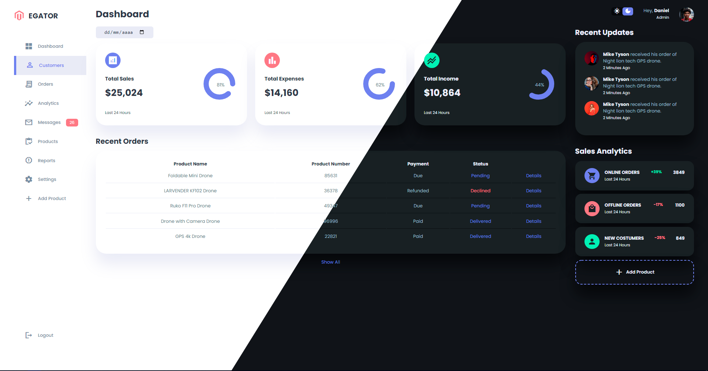

<h1 align="center">
  Admin Dasheboard
</h1>

  <a href="#-tecnologias">Tecnologias</a>&nbsp;&nbsp;&nbsp;|&nbsp;&nbsp;&nbsp;
  <a href="#-projeto">Projeto</a>&nbsp;&nbsp;&nbsp;|&nbsp;&nbsp;&nbsp;

 

  

## 🚀 Tecnologias

Esse projeto foi desenvolvido com as seguintes tecnologias:

- HTML
- CSS
- JavaScript

## 💻 Projeto

Admin Dashboard é painel de administração totalmente responsivo com Tema Claro e Tema Escuro. Além criação de itens para a tabela de "Recent Orders" através de JavaScript.

## Layout ☑
Você pode conferir o layout aqui: 
